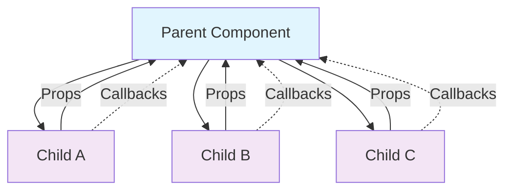

---
# React.js Course Presentation
theme: seriph
# Background for React course
background: https://images.unsplash.com/photo-1633356122544-f134324a6cee?w=1920&h=1080&fit=crop
# Presentation information
title: React.js Fundamentals Course
info: |
  ## Learn Modern React Development

  Comprehensive course covering React.js fundamentals and best practices.

  Reference: [React Documentation](https://react.dev/learn) | [Tic-tac-toe Tutorial](https://react.dev/learn/tutorial-tic-tac-toe)
transition: slide-left
mdc: true
---

# React.js Fundamentals Course

<div class="text-4xl mb-8">
  🚀 Learn Modern React Development
</div>

<div class="text-2xl mb-12">
  AnuchitO
</div>

<div @click="$slidev.nav.next" class="mt-8 py-2 px-6 bg-blue-500 text-white rounded-lg hover:bg-blue-600 transition-colors cursor-pointer inline-block">
  Let's go <carbon:arrow-right class="inline ml-2" />
</div>

<div class="abs-br m-6 text-xl">
  <button @click="$slidev.nav.openInEditor()" title="Open in Editor" class="slidev-icon-btn">
    <carbon:edit />
  </button>
  <a href="https://react.dev" target="_blank" class="slidev-icon-btn">
    <carbon:logo-react />
  </a>
</div>

---
transition: fade-out
layout: center
class: text-center
---

# What You'll Learn

<div class="grid grid-cols-2 gap-8 mt-12 text-left">

<div class="space-y-4">
<div class="flex items-center space-x-3">
  <div class="w-8 h-8 bg-blue-500 rounded-full flex items-center justify-center text-white font-bold">1</div>
  <span class="text-xl">Create and nest components</span>
</div>

<div class="flex items-center space-x-3">
  <div class="w-8 h-8 bg-green-500 rounded-full flex items-center justify-center text-white font-bold">2</div>
  <span class="text-xl">Add markup and styles</span>
</div>

<div class="flex items-center space-x-3">
  <div class="w-8 h-8 bg-purple-500 rounded-full flex items-center justify-center text-white font-bold">3</div>
  <span class="text-xl">Display data</span>
</div>
</div>

<div class="space-y-4">
<div class="flex items-center space-x-3">
  <div class="w-8 h-8 bg-orange-500 rounded-full flex items-center justify-center text-white font-bold">4</div>
  <span class="text-xl">Render conditions and lists</span>
</div>

<div class="flex items-center space-x-3">
  <div class="w-8 h-8 bg-red-500 rounded-full flex items-center justify-center text-white font-bold">5</div>
  <span class="text-xl">Respond to events and update screen</span>
</div>

<div class="flex items-center space-x-3">
  <div class="w-8 h-8 bg-pink-500 rounded-full flex items-center justify-center text-white font-bold">6</div>
  <span class="text-xl">Share data between components</span>
</div>
</div>

</div>

---
layout: two-cols
layoutClass: gap-16
---

# Why React?

Modern, declarative, and component-based approach to building user interfaces

## Key Benefits

- **Component-Based Architecture** - Build encapsulated components
- **Virtual DOM** - Efficient updates and rendering
- **JSX Syntax** - Write HTML-like code in JavaScript
- **Unidirectional Data Flow** - Predictable state management
- **Rich Ecosystem** - Vast collection of libraries and tools

::right::

## Learning Path

<div class="text-sm opacity-75 mt-4">

1. **Core Concepts** → Components, JSX, Props
2. **State & Events** → Managing component state
3. **Lists & Keys** → Dynamic content rendering
4. **Component Communication** → Props, State lifting
5. **Hooks** → Modern state management
6. **Projects** → Apply concepts in real applications

</div>


<div class="text-center mt-8">
  <div class="flex items-left justify-left gap-4">
    
    <div class="text-xl font-bold">React 18+</div>
  </div>
  <div class="space-y-2 text-xs text-left mt-4">
    <div>✅ Declarative UI</div>
    <div>✅ Component Reusability</div>
    <div>✅ Virtual DOM</div>
    <div>✅ Strong Community</div>
    <div>✅ Rich Ecosystem</div>
  </div>
</div>

---
class: text-sm
---

# Create a New React App

## Using Create React App

```bash
npx create-react-app my-app
cd my-app
npm start
```

## Using Vite CommonJS
```bash
npm create vite@latest my-app -- --template react
cd my-app
npm install
npm run dev
```

## Using Vite (Recommended)

```bash
npm create vite@latest my-app -- --template react-ts
cd my-app
npm install
npm run dev
```

---
layout: two-cols-header
layoutClass: gap-4
class: text-sm
---

# 1. Creating Components

Components are the building blocks of React applications

::left::

#### Function Components

```jsx
// Basic function component
function Welcome() {
  return <h1>Hello, World!</h1>;
}

// Arrow function component
const Greeting = () => {
  return <p>Welcome to React!</p>;
};
```

#### Component Naming

- **Capitalize** component names (`Welcome`, not `welcome`)
- Use **PascalCase** for multi-word components (`UserProfile`)
- Components must return **JSX** (React elements)

::right::

#### Nesting Components

```tsx
function App(): JSX.Element {
  return (
    <div>
      <Welcome />
      <Greeting />
    </div>
  );
}
```

<div class="bg-gray-800 p-6 rounded-lg">
<h3 class="mb-4">Key Points</h3>
<ul class="space-y-1">
  <li>Components are JavaScript functions</li>
  <li>They return JSX (React elements)</li>
  <li>Component names must be capitalized</li>
  <li>Components can be nested inside each other</li>
</ul>
</div>

---
layout: two-cols-header
layoutClass: gap-4
class: text-xs
---

# 2. JSX - JavaScript + XML

JSX allows you to write HTML-like syntax in JavaScript

::left::

#### Basic JSX Rules

```jsx
// JSX expressions must have one root element
function Card() {
  return (
    <div className="card">
      <h2>Title</h2>
      <p>Description</p>
    </div>
  );
}
```

#### Embedding JavaScript

```jsx
function Greeting({ name, age }) {
  return (
    <div>
      <h1>Hello, {name}!</h1>
      <p>You are {age} years old.</p>
    </div>
  );
}
```

::right::

#### Multi-line JSX

```jsx
function Profile() {
  return (
    <>
      <h1>Profile</h1>
      
      <p>Bio information...</p>
    </>
  );
}
```

--- 
class: text-xs
---

## JSX Attributes

```jsx
// HTML attributes become JSX attributes


// class becomes className
<div className="container">

// onclick becomes onClick (camelCase)
<button onClick={handleClick}>
```

<br/>

## HTML vs JSX Differences

| HTML | JSX |
|------|-----|
| `class` | `className` |
| `onclick` | `onClick` |
| `for` (label) | `htmlFor` |
| All lowercase | camelCase for event handlers |
| String attributes | Expressions in `{}` |

---
layout: two-cols
layoutClass: gap-2
class: text-xs
---

# 3. Adding Styles

Multiple ways to style React components

#### Inline Styles

```jsx
function StyledComponent() {
  const styles = {
    color: 'blue',
    fontSize: '20px',
    padding: '10px',
    borderRadius: '5px'
  };

  return <div style={styles}>Styled Content</div>;
}
```

::right::

#### CSS Classes (Recommended)

```jsx
import './Card.css';

function Card() {
  return (
    <div className="card">
      <h2 className="card-title">Title</h2>
      <p className="card-content">Content</p>
    </div>
  );
}
```

#### CSS Modules

```jsx
import styles from './Card.module.css';

function Card() {
  return (
    <div className={styles.card}>
      <h2 className={styles.title}>Title</h2>
      <p className={styles.content}>Content</p>
    </div>
  );
}
```

---
layout: two-cols-header
layoutClass: gap-2
class: text-xs
---

# CSS vs CSS Modules

<div class="text-xs mb-4">

| Aspect                                   | CSS                                  | CSS Modules                                     |
| ---------------------------------------- | ------------------------------------ | ----------------------------------------------- |
| Import                                   | `import './Card.css';`               | `import styles from './Card.module.css';`       |
| Usage                                    | `card`, `card-title`, `card-content` | `styles.card`, `styles.title`, `styles.content` |
| Prevents Naming Conflicts                | No `card` → `card`                   | Yes `styles.card` → `Card_card__abc123`          |
| Tree Shaking - unused styles are removed | No                                   | Yes                                             |
| Scope                                    | Global                               | Local                                           |

</div>

::left::

#### CSS -- Card.css

```css {none}
.card {
  color: blue;
  font-size: 20px;
  padding: 10px;
  border-radius: 5px;
}
```

::right::

#### CSS Modules -- Card.module.css

```css {none}
.card {
  color: blue;
  font-size: 20px;
  padding: 10px;
  border-radius: 5px;
}
```

---
layout: two-cols-header
layoutClass: gap-2
class: text-xs
---

# 4. Displaying Data

Pass data to components using **props**

::left::

#### Props Basics

```tsx
// Parent component
function App(): JSX.Element {
  return (
    <div>
      <Greeting name="Alice" age={25} />
      <Greeting name="Bob" age={30} />
    </div>
  );
}

// Child component
function Greeting({ name, age }: { name: string; age: number }): JSX.Element {
  return (
    <div>
      <h1>Hello, {name}!</h1>
      <p>You are {age} years old.</p>
    </div>
  );
}
```

::right::

#### Props are Read-Only

```tsx
function Greeting({ name }: { name: string }): JSX.Element {
  // ❌ This won't work
  name = "Modified"; // Props are immutable

  // ✅ Do this instead
  return <h1>Hello, {name}!</h1>;
}
```

#### Default Props

```tsx
function Greeting({ name = "Guest", age }: { name?: string; age?: number }): JSX.Element {
  return (
    <div>
      <h1>Hello, {name}!</h1>
      {age && <p>You are {age} years old.</p>}
    </div>
  );
}
```

---

# Props Types

<div class="bg-dark-500 p-4 rounded-lg">
<h4 class="font-bold mb-2">Common Prop Patterns</h4>

- **String** → `<Component text="Hello" />`
- **Number** → `<Component count={5} />`
- **Boolean** → `<Component isVisible={true} />`
- **Array** → `<Component items={[1,2,3]} />`
- **Object** → `<Component user={{name: "John"}} />`
- **Function** → `<Component onClick={handleClick} />`

<br>

<h4 class="font-bold mb-2">Best Practices</h4>
- Keep props simple and focused
- Use destructuring for cleaner code
- Validate props in development (PropTypes)
- Document prop requirements
</div>

---

# 5. Conditional Rendering

Show different content based on conditions

## If Statements

```tsx
function UserStatus({ isLoggedIn }: { isLoggedIn: boolean }): JSX.Element {
  if (isLoggedIn) {
    return <h1>Welcome back!</h1>;
  }

  return <h1>Please sign in.</h1>;
}
```

## Ternary Operator

```tsx
function UserStatus({ isLoggedIn }: { isLoggedIn: boolean }): JSX.Element {
  return (
    <h1>
      {isLoggedIn ? 'Welcome back!' : 'Please sign in.'}
    </h1>
  );
}
```

---

## Logical AND Operator

```tsx
function Mailbox({ unreadMessages }: { unreadMessages: unknown[] }): JSX.Element {
  return (
    <div>
      <h1>Hello!</h1>
      {unreadMessages.length > 0 && (
        <p>
          You have {unreadMessages.length} unread messages.
        </p>
      )}
    </div>
  );
}
```

## Conditional Classes

```jsx
function Button({ isActive }) {
  return (
    <button className={`btn ${isActive ? 'active' : ''}`}>
      Click me
    </button>
  );
}
```

---
layout: two-cols
layoutClass: gap-4
---

## Switch Statements

```jsx
function StatusMessage({ status }) {
  switch (status) {
    case 'loading':
      return <div>Loading...</div>;
    case 'success':
      return <div>Success!</div>;
    case 'error':
      return <div>Error occurred</div>;
    default:
      return <div>Unknown status</div>;
  }
}
```

::right::

## Conditional Lists

```jsx
function ProductList({ products, isAdmin }) {
  return (
    <div>
      {products.map(product => (
        <div key={product.id}>
          <h3>{product.name}</h3>
          {isAdmin && (
            <button>Edit</button>
          )}
        </div>
      ))}
    </div>
  );
}
```

---

# 6. Rendering Lists

Display arrays of data in React

### Basic List Rendering

```tsx
type Product = {
  id: number;
  name: string;
}

type ProductListProps = {
  products: Array<Product>;
}

function ProductList({ products }: ProductListProps): JSX.Element {
  return (
    <ul>
      {products.map(product => (
        <li key={product.id}>
          {product.name}
        </li>
      ))}
    </ul>
  );
}
```
--- 

#### Keys in Lists

```jsx {3,8}
// ❌ Missing keys (React warning)
{products.map(product => (
  <li>{product.name}</li>
))}

// ✅ With keys
{products.map(product => (
  <li key={product.id}>{product.name}</li>
))}
```

#### List with Complex JSX

```jsx
function TodoList({ todos }) {
  return (
    <ul className="todo-list">
      {todos.map(todo => (
        <li key={todo.id} className="todo-item">
          <input type="checkbox" checked={todo.completed}/>
          <span className={todo.completed ? 'completed' : ''}>{todo.text}</span>
          <button>Delete</button>
        </li>
      ))}
    </ul>
  );
}
```

---
layoutClass: text-xs
---

# 7. Event Handling -- Respond to user interactions

#### Basic Event Handlers

```tsx
function Button(): JSX.Element {
  function handleClick(): void {
    console.log('Button clicked!');
  }

  return <button onClick={handleClick}>Click me</button>;
}
```

#### Event Handler with Parameters

```tsx
function Button({ msg }: { msg: string }): JSX.Element {
  function handleClick(): void {
    alert(msg);
  }

  return <button onClick={handleClick}>Show Message</button>;
}
```

--- 

#### Arrow Function Handlers

```tsx
function Counter(): JSX.Element {
  const [count, setCount] = useState<number>(0);

  return (
    <div>
      <p>Count: {count}</p>
      <button onClick={() => setCount(count + 1)}>
        Increment
      </button>
    </div>
  );
}
```

#### Event Object

```tsx
function Form(): JSX.Element {
  function handleSubmit(event: React.FormEvent<HTMLFormElement>): void {
    event.preventDefault();
    console.log('Form submitted');
  }
  return (
    <form onSubmit={handleSubmit}>
      <button type="submit">Submit</button>
    </form>
  );
}
```

--- 

## Common Events

| Event | Description | Element |
|-------|-------------|---------|
| `onClick` | User clicks | buttons, links, divs |
| `onChange` | Input value changes | input, textarea, select |
| `onSubmit` | Form submission | form |
| `onKeyDown` | Key pressed | input, textarea |
| `onKeyUp` | Key released | input, textarea |
| `onFocus` | Element focused | input, textarea |
| `onBlur` | Element loses focus | input, textarea |

---

# Event Handler Best Practices

- Use arrow functions for inline handlers
- Pass functions, not function calls
- Use `event.preventDefault()` for forms -- <small>Prevent default form submission behavior e.g. page refresh after submit form</small>
- Clean up event listeners if needed -- <small>e.g. remove event listeners in `useEffect` cleanup function</small>

---
layout: image-right
image: https://images.unsplash.com/photo-1551650975-87deedd944c3?w=800&h=600&fit=crop
---

# 8. State Management

Manage component data that changes over time

## useState Hook

```tsx
import { useState } from 'react';

function Counter(): JSX.Element {
  // Declare state variable
  const [count, setCount] = useState<number>(0);

  return (
    <div>
      <p>Count: {count}</p>
      <button onClick={() => setCount(count + 1)}>
        Increment
      </button>
      <button onClick={() => setCount(count - 1)}>
        Decrement
      </button>
    </div>
  );
}
```

--- 

## State Updates

```tsx
function Counter(): JSX.Element {
  const [count, setCount] = useState<number>(0);

  const increment = (): void => {
    setCount(count + 1);        // ✅ Correct
    setCount(count + 1);        // ❌ May not work as expected. because React batches state updates for performance
  };

  const incrementTwice = (): void => {
    setCount(prevCount => prevCount + 1);
    setCount(prevCount => prevCount + 1);
  };
}
```

--- 

## Multiple State Variables

```tsx 
function Form(): JSX.Element {
  const [name, setName] = useState<string>('');
  const [email, setEmail] = useState<string>('');
  const [age, setAge] = useState<number>(0);

  return (
    <form>
      <input
        value={name}
        onChange={e => setName(e.target.value)}
        placeholder="Name"
      />
      <input
        value={email}
        onChange={e => setEmail(e.target.value)}
        placeholder="Email"
      />
      <input
        type="number"
        value={age}
        onChange={e => setAge(Number(e.target.value))}
        placeholder="Age"
      />
    </form>
  )};
```

---
layout: two-cols-header
layoutClass: gap-4
---

## State Guidelines

::left::

<h4 class="font-bold mb-2">When to Use State</h4>

- ✅ User input (forms, search)
- ✅ UI state (modals, dropdowns)
- ✅ Server data (API responses)
- ✅ Component lifecycle state

<br>
::right::
<h4 class="font-bold mb-2">State Best Practices</h4>

- Keep state as simple as possible
- Group related state together
- Avoid deep nesting in state objects
- Use functional updates for async operations
- Don't mutate state directly

---
layout: two-cols
---

# 9. Sharing Data Between Components

Pass data from parent to child and lift state up

## Props: Parent to Child

```tsx
// Parent component
function App(): JSX.Element {
  const [user, setUser] = useState<{name: string; email: string}>({
    name: 'John',
    email: 'john@example.com'
  });

  return (
    <div>
      <Header user={user} />
      <Profile user={user} />
    </div>
  );
}

// Child component
function Profile({ user }: { user: {name: string; email: string} }): JSX.Element {
  return (
    <div>
      <h2>{user.name}</h2>
      <p>{user.email}</p>
    </div>
  );
}
```

## Lifting State Up - Clear Examples 🚀

When **sibling components** need to share or modify the same data.

::left::

### ❌ **Before: State in Child** (Can't share between siblings)

```tsx
// Each child manages its own cart state
function ProductCard({ product }: { product: { id: number; name: string; price: number } }): JSX.Element {
  const [cart, setCart] = useState<Array<{id: number; name: string; price: number}>>([]);
  const [cartCount, setCartCount] = useState<number>(0);

  const addToCart = (): void => {
    setCart([...cart, product]);
    setCartCount(cartCount + 1);
  };

  return (
    <div className="product-card">
      <h3>{product.name}</h3>
      <p>${product.price}</p>
      <button onClick={addToCart}>Add to Cart</button>
    </div>
  );
}

function CartDisplay(): JSX.Element {
  const [cart, setCart] = useState<Array<{id: number; name: string; price: number}>>([]); // ❌ Different cart!
  const [total, setTotal] = useState<number>(0);

  return (
    <div className="cart">
      <h3>Shopping Cart ({cart.length} items)</h3>
      {cart.map(item => (
        <div key={item.id} className="cart-item">
          {item.name} - ${item.price}
        </div>
      ))}
      <p className="total">Total: ${total}</p>
    </div>
  );
}

// Parent can't coordinate - each has independent cart!
function EcommerceApp(): JSX.Element {
  return (
    <div className="app">
      <ProductCard product={{ id: 1, name: "Laptop", price: 999 }} />
      <ProductCard product={{ id: 2, name: "Mouse", price: 25 }} />
      <CartDisplay /> {/* Shows empty cart - no items added! */}
    </div>
  );
}
```

::right::

### ✅ **After: State in Parent** (Shared state)

```tsx
// Child components receive cart data and callbacks
function ProductCard({
  product,
  onAddToCart
}: {
  product: { id: number; name: string; price: number };
  onAddToCart: (product: { id: number; name: string; price: number }) => void;
}): JSX.Element {
  return (
    <div className="product-card">
      <h3>{product.name}</h3>
      <p>${product.price}</p>
      <button onClick={() => onAddToCart(product)}>Add to Cart</button>
    </div>
  );
}

function CartDisplay({
  cart,
  total
}: {
  cart: Array<{id: number; name: string; price: number}>;
  total: number;
}): JSX.Element {
  return (
    <div className="cart">
      <h3>Shopping Cart ({cart.length} items)</h3>
      {cart.map(item => (
        <div key={item.id} className="cart-item">
          {item.name} - ${item.price}
        </div>
      ))}
      <p className="total">Total: ${total.toFixed(2)}</p>
    </div>
  );
}

// Parent manages shared cart state
function EcommerceApp(): JSX.Element {
  const [cart, setCart] = useState<Array<{id: number; name: string; price: number}>>([]);

  const addToCart = (product: { id: number; name: string; price: number }): void => {
    setCart([...cart, product]);
  };

  const total = cart.reduce((sum, item) => sum + item.price, 0);

  return (
    <div className="app">
      <ProductCard
        product={{ id: 1, name: "Laptop", price: 999 }}
        onAddToCart={addToCart}
      />
      <ProductCard
        product={{ id: 2, name: "Mouse", price: 25 }}
        onAddToCart={addToCart}
      />
      <CartDisplay cart={cart} total={total} />
      {/* Cart now shows all added items! 🎉 */}
    </div>
  );
}
```

---

## Real-World Example: Todo App 📝

### ❌ **Problem: Can't share todos between components**

```tsx
// Todo input - has its own state
function TodoInput(): JSX.Element {
  const [todos, setTodos] = useState<string[]>([]);
  const [input, setInput] = useState<string>('');

  const addTodo = (): void => {
    if (input.trim()) {
      setTodos([...todos, input]);
      setInput('');
    }
  };

  return (
    <div>
      <input value={input} onChange={e => setInput(e.target.value)} />
      <button onClick={addTodo}>Add</button>
    </div>
  );
}

// Todo list - has its own separate state
function TodoList(): JSX.Element {
  const [todos, setTodos] = useState<string[]>([]); // ❌ Different state!

  return (
    <ul>
      {todos.map((todo, i) => <li key={i}>{todo}</li>)}
    </ul>
  );
}
```

### ✅ **Solution: Lift state to parent**

```tsx
// Todo input - receives callbacks
function TodoInput({ onAddTodo }: { onAddTodo: (todo: string) => void }): JSX.Element {
  const [input, setInput] = useState<string>('');

  const handleSubmit = (): void => {
    if (input.trim()) {
      onAddTodo(input);
      setInput('');
    }
  };

  return (
    <div>
      <input value={input} onChange={e => setInput(e.target.value)} />
      <button onClick={handleSubmit}>Add</button>
    </div>
  );
}

// Todo list - receives todos as props
function TodoList({ todos }: { todos: string[] }): JSX.Element {
  return (
    <ul>
      {todos.map((todo, i) => <li key={i}>{todo}</li>)}
    </ul>
  );
}

// Parent manages shared state
function TodoApp(): JSX.Element {
  const [todos, setTodos] = useState<string[]>([]);

  const addTodo = (todo: string): void => {
    setTodos([...todos, todo]);
  };

  return (
    <div>
      <TodoInput onAddTodo={addTodo} />
      <TodoList todos={todos} />
    </div>
  );
}
```

---

## 🏗️ **Data Flow Pattern**



**Data flows down** ⬇️ through props
**Events flow up** ⬆️ through callbacks

---

## 🎯 **When to Lift State Up**

- ✅ **Siblings need same data** (counters, todo items)
- ✅ **Parent needs to coordinate children** (form steps, wizard)
- ✅ **Data needs to persist across renders** (search results)
- ✅ **Multiple components modify same data** (shopping cart)

---

## 🚀 **Real-Life "Lifting State Up" Scenarios**

Here are **practical examples** developers encounter every day:

---

## 1. **E-commerce Shopping Cart** 🛒

### ❌ **Problem: Cart items not shared**
```tsx
// Add to cart button - has its own cart state
function ProductCard({ product }: { product: Product }): JSX.Element {
  const [cart, setCart] = useState<Product[]>([]); // ❌ Local state

  const addToCart = () => {
    setCart([...cart, product]);
  };

  return (
    <div>
      <h3>{product.name}</h3>
      <button onClick={addToCart}>Add to Cart</button>
    </div>
  );
}

// Cart display - has separate cart state
function CartDisplay(): JSX.Element {
  const [cart, setCart] = useState<Product[]>([]); // ❌ Different state!

  return (
    <div>
      Cart: {cart.length} items
      {cart.map(item => <div key={item.id}>{item.name}</div>)}
    </div>
  );
}
```

### ✅ **Solution: Shared cart state**
```tsx
// Parent manages cart state
function EcommerceApp(): JSX.Element {
  const [cart, setCart] = useState<Product[]>([]);

  const addToCart = (product: Product) => {
    setCart([...cart, product]);
  };

  return (
    <div>
      <ProductCard product={product} onAddToCart={addToCart} />
      <CartDisplay cart={cart} />
      {/* Both show same cart data! */}
    </div>
  );
}
```

---

## 2. **Social Media Post** 📱

### ❌ **Problem: Like counts not synchronized**
```tsx
// Post component - local likes state
function Post({ post }: { post: Post }): JSX.Element {
  const [likes, setLikes] = useState<number>(post.likes); // ❌ Local state

  const handleLike = () => {
    setLikes(likes + 1);
  };

  return (
    <div>
      <p>{post.content}</p>
      <button onClick={handleLike}>Like ({likes})</button>
    </div>
  );
}

// Like counter widget - separate state
function LikeCounter(): JSX.Element {
  const [totalLikes, setTotalLikes] = useState<number>(0); // ❌ Different count!

  return <div>Total Likes: {totalLikes}</div>;
}
```

### ✅ **Solution: Lifted state for consistency**
```tsx
function SocialApp(): JSX.Element {
  const [totalLikes, setTotalLikes] = useState<number>(0);

  const handleLike = () => {
    setTotalLikes(prev => prev + 1);
  };

  return (
    <div>
      <Post onLike={handleLike} />
      <LikeCounter totalLikes={totalLikes} />
      <NotificationBadge likeCount={totalLikes} />
    </div>
  );
}
```

---

## 3. **Multi-Step Form Wizard** 📝

### ❌ **Problem: Form data lost between steps**
```tsx
// Step 1 - personal info
function PersonalInfoStep(): JSX.Element {
  const [formData, setFormData] = useState<FormData>({
    name: '', email: ''
  }); // ❌ Local state

  return (
    <form>
      <input
        value={formData.name}
        onChange={e => setFormData({...formData, name: e.target.value})}
      />
    </form>
  );
}

// Step 2 - address info (can't access step 1 data)
function AddressStep(): JSX.Element {
  const [formData, setFormData] = useState<FormData>({
    address: '', city: ''
  }); // ❌ Separate state - no name/email!

  return (
    <form>
      <input value={formData.address} placeholder="Address" />
    </form>
  );
}
```

### ✅ **Solution: Shared form state across steps**
```tsx
function FormWizard(): JSX.Element {
  const [currentStep, setCurrentStep] = useState<number>(1);
  const [formData, setFormData] = useState<FormData>({
    name: '', email: '', address: '', city: ''
  });

  const updateFormData = (field: keyof FormData, value: string) => {
    setFormData(prev => ({ ...prev, [field]: value }));
  };

  return (
    <div>
      {currentStep === 1 && (
        <PersonalInfoStep
          formData={formData}
          onUpdate={updateFormData}
        />
      )}
      {currentStep === 2 && (
        <AddressStep
          formData={formData}
          onUpdate={updateFormData}
        />
      )}
      {/* All steps share same formData */}
    </div>
  );
}
```

---

## 4. **Dashboard with Filters** 📊

### ❌ **Problem: Filters don't affect all widgets**
```tsx
// Filter component - local filter state
function FilterBar(): JSX.Element {
  const [filters, setFilters] = useState<Filters>({
    category: 'all', dateRange: '7d'
  }); // ❌ Local state

  return (
    <div>
      <select value={filters.category}>
        {/* filter options */}
      </select>
    </div>
  );
}

// Chart widget - can't see filter changes
function SalesChart(): JSX.Element {
  const [data, setData] = useState<Data[]>([]); // ❌ No filter awareness

  return <div>Sales Chart (unfiltered)</div>;
}

// Table widget - also can't see filters
function SalesTable(): JSX.Element {
  const [data, setData] = useState<Data[]>([]); // ❌ No filter awareness

  return <div>Sales Table (unfiltered)</div>;
}
```

### ✅ **Solution: Centralized filter state**
```tsx
function Dashboard(): JSX.Element {
  const [filters, setFilters] = useState<Filters>({
    category: 'all', dateRange: '7d'
  });

  const filteredData = useMemo(() => {
    return data.filter(item => {
      // Apply filters to data
      return applyFilters(item, filters);
    });
  }, [data, filters]);

  return (
    <div>
      <FilterBar filters={filters} onFiltersChange={setFilters} />
      <div className="grid">
        <SalesChart data={filteredData} />
        <SalesTable data={filteredData} />
        <KPICards data={filteredData} />
      </div>
      {/* All widgets update when filters change! */}
    </div>
  );
}
```

---

## 5. **Music Player Controls** 🎵

### ❌ **Problem: Play/pause state not synchronized**
```tsx
// Player controls - local state
function PlayerControls(): JSX.Element {
  const [isPlaying, setIsPlaying] = useState<boolean>(false); // ❌ Local state

  return (
    <div>
      <button onClick={() => setIsPlaying(!isPlaying)}>
        {isPlaying ? 'Pause' : 'Play'}
      </button>
    </div>
  );
}

// Progress bar - doesn't know play state
function ProgressBar(): JSX.Element {
  const [progress, setProgress] = useState<number>(0); // ❌ No play state

  return <div>Progress: {progress}%</div>;
}

// Volume control - also independent
function VolumeControl(): JSX.Element {
  const [volume, setVolume] = useState<number>(50); // ❌ No coordination

  return <input type="range" value={volume} />;
}
```

### ✅ **Solution: Unified player state**
```tsx
function MusicPlayer(): JSX.Element {
  const [isPlaying, setIsPlaying] = useState<boolean>(false);
  const [currentTime, setCurrentTime] = useState<number>(0);
  const [volume, setVolume] = useState<number>(50);

  // All children receive shared state and controls
  return (
    <div>
      <PlayerControls
        isPlaying={isPlaying}
        onPlayPause={() => setIsPlaying(!isPlaying)}
      />
      <ProgressBar
        currentTime={currentTime}
        isPlaying={isPlaying}
      />
      <VolumeControl
        volume={volume}
        onVolumeChange={setVolume}
      />
    </div>
  );
}
```

---

## 🎯 **Pattern Recognition**

**You need "Lifting State Up" when:**

- **Multiple components** need the **same data**
- **One component's actions** should **affect siblings**
- **Parent needs to coordinate** child component behavior
- **Data needs to persist** across component re-renders
- **State changes** need to **trigger updates** in multiple places

**Common scenarios:**
- Shopping carts, forms, dashboards, media players, collaborative tools, real-time apps

```tsx
// Create context
const ThemeContext = createContext<string>('light');

// Provide context
function App(): JSX.Element {
  return (
    <ThemeContext.Provider value="dark">
      <Toolbar />
    </ThemeContext.Provider>
  );
}

// Use context
function Button(): JSX.Element {
  const theme = useContext(ThemeContext);
  return <button className={theme}>Click me</button>;
}
```

::right::

## Data Flow Patterns

<div class="bg-gray-800 p-4 rounded-lg">

### 1. **Props Down**
- Pass data from parent to children
- Unidirectional data flow
- Most common pattern

### 2. **Events Up**
- Children notify parents of changes
- Parents manage state
- Handle user interactions

### 3. **Context**
- Share data across component tree
- Avoid "prop drilling"
- Use for global state

<br>

<h4 class="font-bold">Best Practices</h4>
- Keep state as close as possible to where it's needed
- Lift state up only when multiple components need it
- Use context sparingly for truly global state
- Prefer props for component communication
</div>

---
layout: center
class: text-center
---

# 10. Building a Complete App

Putting it all together with a practical example

## Tic-Tac-Toe Game

<div class="text-2xl mb-8 font-bold">🎮 Let's Build Tic-Tac-Toe!</div>

<div class="bg-gray-800 p-6 rounded-lg max-w-md mx-auto">
  <div class="text-center">
    <div class="grid grid-cols-3 gap-2 mb-4">
      <div class="w-16 h-16 bg-gray-200 rounded flex items-center justify-center text-2xl font-bold">X</div>
      <div class="w-16 h-16 bg-gray-200 rounded flex items-center justify-center text-2xl font-bold">O</div>
      <div class="w-16 h-16 bg-gray-200 rounded flex items-center justify-center text-2xl font-bold">X</div>
      <div class="w-16 h-16 bg-gray-200 rounded flex items-center justify-center text-2xl font-bold">O</div>
      <div class="w-16 h-16 bg-blue-200 rounded flex items-center justify-center text-2xl font-bold">X</div>
      <div class="w-16 h-16 bg-gray-200 rounded flex items-center justify-center text-2xl font-bold"></div>
      <div class="w-16 h-16 bg-gray-200 rounded flex items-center justify-center text-2xl font-bold">O</div>
      <div class="w-16 h-16 bg-gray-200 rounded flex items-center justify-center text-2xl font-bold">X</div>
      <div class="w-16 h-16 bg-gray-200 rounded flex items-center justify-center text-2xl font-bold">O</div>
    </div>
    <div class="text-lg font-bold">Next player: X</div>
    <button class="mt-4 px-4 py-2 bg-blue-500 text-white rounded hover:bg-blue-600">
      Restart Game
    </button>
  </div>
</div>

---
layout: image-right
image: https://images.unsplash.com/photo-1517180102446-f3ece451e9d8?w=800&h=600&fit=crop
---

# Project Structure

Organize your React application effectively

## File Organization

```
src/
  components/
    Button.jsx
    Card.jsx
    Header.jsx
  pages/
    Home.jsx
    About.jsx
  hooks/
    useAuth.js
    useApi.js
  utils/
    helpers.js
  App.jsx
  index.jsx
```

## Component Structure

```tsx
// Button.jsx
import React from 'react';
import './Button.css';

const Button = ({ children, onClick, variant = 'primary' }: {
  children: React.ReactNode;
  onClick?: () => void;
  variant?: string;
}): JSX.Element => {
  return (
    <button
      className={`btn btn-${variant}`}
      onClick={onClick}
    >
      {children}
    </button>
  );
};

export default Button;
```

## Best Practices

- **One component per file**
- **Clear component naming**
- **Separate concerns** (UI, logic, styles)
- **Reusable components**
- **Consistent file structure**

::right::

## Project Setup

```bash
# Create new React app
npx create-react-app tic-tac-toe

# Navigate to project
cd tic-tac-toe

# Start development server
npm start
```

<br>

## Development Tools

<div class="bg-green-50 p-4 rounded-lg">
<h4 class="font-bold mb-2">Essential Tools</h4>

- **React DevTools** - Browser extension for debugging
- **ESLint** - Code linting and formatting
- **Prettier** - Code formatting
- **Vite** - Fast build tool (alternative to CRA)
- **TypeScript** - Type safety (optional)

<br>

<h4 class="font-bold mb-2">Learning Resources</h4>
- 📖 [React Documentation](https://react.dev/learn)
- 🎮 [Tic-tac-toe Tutorial](https://react.dev/learn/tutorial-tic-tac-toe)
- 🧪 [React Testing](https://react.dev/learn/testing)
- 📚 [React Patterns](https://www.patterns.dev/posts/react-component-patterns)
</div>

---
layout: center
class: text-center
---

# 11. React Hooks

Modern React state management and side effects

## What are Hooks?

<div class="text-2xl mb-8 font-bold">🪝</div>

Hooks are functions that let you "hook into" React state and lifecycle features from function components.

- **No more classes** - Use state and lifecycle in function components
- **Reusable logic** - Share stateful logic between components
- **Modern React** - The future of React development

## Built-in Hooks

<div class="grid grid-cols-3 gap-6 mt-8">

<div class="text-center">
  <div class="w-12 h-12 bg-blue-500 rounded-full flex items-center justify-center text-white text-xl font-bold mx-auto mb-2">🎯</div>
  <h3 class="text-lg font-bold">useState</h3>
  <p class="text-sm opacity-75">Manage component state</p>
</div>

<div class="text-center">
  <div class="w-12 h-12 bg-green-500 rounded-full flex items-center justify-center text-white text-xl font-bold mx-auto mb-2">⚡</div>
  <h3 class="text-lg font-bold">useEffect</h3>
  <p class="text-sm opacity-75">Side effects & lifecycle</p>
</div>

<div class="text-center">
  <div class="w-12 h-12 bg-purple-500 rounded-full flex items-center justify-center text-white text-xl font-bold mx-auto mb-2">🌐</div>
  <h3 class="text-lg font-bold">useContext</h3>
  <p class="text-sm opacity-75">Access context values</p>
</div>

</div>

---
class: text-xs
---

# React Hooks Demo (most ➜ least used)

### useState
```tsx
import { useState } from 'react';

function Counter(): JSX.Element {
  const [count, setCount] = useState<number>(0);
  return (
    <button onClick={() => setCount(c => c + 1)}>
      Count: {count}
    </button>
  );
}
```

### useEffect
```tsx
import { useEffect } from 'react';

useEffect((): (() => void) => {
  const id = setInterval((): void => console.log('tick'), 1000);
  return (): void => clearInterval(id);
}, []);
```

---

### useMemo / useCallback
```tsx
import { useMemo, useCallback } from 'react';

const total = useMemo(() => items.reduce((s, x) => s + x.price, 0), [items]);
const onSelect = useCallback((id: number): void => setSelected(id), [setSelected]);
```

### useRef
```tsx
import { useRef, useEffect } from 'react';

const inputRef = useRef<HTMLInputElement>(null);
useEffect(() => inputRef.current?.focus(), []);
```

### useContext
```tsx
const theme = useContext(ThemeContext);
```

### useReducer
```tsx
import { useReducer } from 'react';

function reducer(c: number, a: 'inc' | 'dec'): number {
  return a === 'inc' ? c + 1 : c - 1;
}
const [count, dispatch] = useReducer(reducer, 0);
```

--- 

### Other hooks (quick refs)
- **useId** → generate stable IDs for accessibility
- **useTransition** → mark state updates as non-urgent
- **useDeferredValue** → defer expensive re-render values
- **useLayoutEffect** → sync after DOM mutations (layout reads)
- **useImperativeHandle** → expose imperative methods to parents
- **useDebugValue** → label values in custom hooks for DevTools
- **useSyncExternalStore** → subscribe to external stores reliably
- **useInsertionEffect** → CSS-in-JS style injection timing

<div class="mt-2 text-[10px] opacity-75">Reference: react.dev/reference/react/hooks</div>

---
layout: two-cols
---

# useEffect Hook

Perform side effects in function components

## Basic useEffect

```tsx
import { useState, useEffect } from 'react';

function Timer(): JSX.Element {
  const [count, setCount] = useState<number>(0);

  useEffect((): (() => void) => {
    // Side effect: Update document title
    document.title = `Count: ${count}`;
  });

  return (
    <div>
      <p>Count: {count}</p>
      <button onClick={() => setCount(count + 1)}>
        Increment
      </button>
    </div>
  );
}
```

## Effect Dependencies

```tsx
useEffect((): (() => void) => {
  // Runs after every render
}, []);

useEffect((): (() => void) => {
  // Runs only when 'count' changes
}, [count]);

useEffect((): (() => void) => {
  // Runs only when 'userId' changes
}, [userId]);
```

## Cleanup Effects

```tsx
useEffect((): (() => void) => {
  // Set up subscription
  const subscription = subscribeToUserStatus(userId);

  // Cleanup function
  return (): void => {
    subscription.unsubscribe();
  };
}, [userId]);
```

::right::

## Common useEffect Patterns

<div class="bg-gray-800 p-4 rounded-lg">

### 1. **API Calls**
```jsx
useEffect(() => {
  fetchUserData(userId)
    .then(setUser);
}, [userId]);
```

### 2. **Event Listeners**
```jsx
useEffect(() => {
  window.addEventListener('resize', handleResize);
  return () => window.removeEventListener('resize', handleResize);
}, []);
```

### 3. **Timers**
```jsx
useEffect(() => {
  const timer = setInterval(() => {
    setTime(new Date());
  }, 1000);

  return () => clearInterval(timer);
}, []);
```

<br>

<h4 class="font-bold">Effect Rules</h4>
- Effects run **after** every render
- Use dependencies array to control when effects run
- Always cleanup subscriptions/timers in return function
- Don't put objects/functions in dependencies (use useCallback/useMemo)

</div>

---
layout: two-cols-header
class: text-xs
---

# useEffect: Calling an API

::left::

```tsx
import { useEffect, useState } from 'react';

type User = { id: number; name: string };

function Users(): JSX.Element {
  const [users, setUsers] = useState<User[]>([]);
  const [loading, setLoading] = useState<boolean>(true);
  const [error, setError] = useState<string | null>(null);

  useEffect(() => {
    const ctrl = new AbortController();
    async function load(): Promise<void> {
      try {
        setLoading(true);
        setError(null);
        const res = await fetch('https://jsonplaceholder.typicode.com/users', { signal: ctrl.signal });
        if (!res.ok) throw new Error(`HTTP ${res.status}`);
        const data: User[] = await res.json();
        setUsers(data);
      } catch (err) {
        if ((err as any).name !== 'AbortError') setError((err as Error).message);
      } finally {
        setLoading(false);
      }
    }
    load();
    return () => ctrl.abort();
  }, []);

  if (loading) return <div>Loading...</div>;
  if (error) return <div>Error: {error}</div>;
  return (
    <ul>
      {users.map(u => <li key={u.id}>{u.name}</li>)}
    </ul>
  );
}
```

::right::

- **Dependencies** — add to array when fetch depends on props/state (e.g., `userId`)
- **Abort on cleanup** — cancel in-flight requests on unmount or param change
- **Handle loading/error** — show UI states for better UX
- **Idempotent effects** — avoid re-fetching by stabilizing inputs
- **Separate concerns** — extract to `useFetch` custom hook for reuse

<div class="mt-2 text-[10px] opacity-75">Reference: react.dev/reference/react/useEffect</div>

---
layout: image-right
image: https://images.unsplash.com/photo-1555949963-aa79dcee981c?w=800&h=600&fit=crop
---

# useContext Hook

Access context values without nesting

## Creating Context

```tsx
// ThemeContext.js
import { createContext } from 'react';

export const ThemeContext = createContext<string>('light');
```

## Providing Context

```tsx
// App.jsx
import { ThemeContext } from './ThemeContext';

function App(): JSX.Element {
  return (
    <ThemeContext.Provider value="dark">
      <Toolbar />
    </ThemeContext.Provider>
  );
}
```

## Consuming Context

```tsx
// Button.jsx
import { useContext } from 'react';
import { ThemeContext } from './ThemeContext';

function Button(): JSX.Element {
  const theme = useContext(ThemeContext);

  return (
    <button className={`btn-${theme}`}>
      Themed Button
    </button>
  );
}
```

::right::

## Context with State

<div class="bg-gray-800 p-4 rounded-lg">

```tsx
// UserContext.jsx
import { createContext, useContext } from 'react';

const UserContext = createContext<{
  user: unknown;
  login: (userData: unknown) => void;
  logout: () => void;
} | undefined>(undefined);

export function useUser(): {
  user: unknown;
  login: (userData: unknown) => void;
  logout: () => void;
} {
  return useContext(UserContext)!;
}

export function UserProvider({ children }: { children: React.ReactNode }): JSX.Element {
  const [user, setUser] = useState<unknown>(null);

  const login = (userData: unknown): void => {
    setUser(userData);
  };

  const logout = (): void => {
    setUser(null);
  };

  const value = {
    user,
    login,
    logout
  };

  return (
    <UserContext.Provider value={value}>
      {children}
    </UserContext.Provider>
  );
}
```

## Usage in Components

```tsx
function Profile(): JSX.Element {
  const { user, logout } = useUser();

  if (!user) return <div>Please login</div>;

  return (
    <div>
      <h1>Welcome, {user.name}!</h1>
      <button onClick={logout}>Logout</button>
    </div>
  );
}
```

</div>

---
layout: two-cols
---

# Custom Hooks

Extract component logic into reusable functions

## Creating Custom Hooks

```tsx
// useCounter.js
import { useState } from 'react';

export function useCounter(initialValue: number = 0): {
  count: number;
  increment: () => void;
  decrement: () => void;
  reset: () => void;
} {
  const [count, setCount] = useState<number>(initialValue);

  const increment = (): void => setCount(c => c + 1);
  const decrement = (): void => setCount(c => c - 1);
  const reset = (): void => setCount(initialValue);

  return {
    count,
    increment,
    decrement,
    reset
  };
}
```

## Using Custom Hooks

```tsx
function Counter(): JSX.Element {
  const { count, increment, decrement, reset } = useCounter(0);

  return (
    <div>
      <p>Count: {count}</p>
      <button onClick={increment}>+</button>
      <button onClick={decrement}>-</button>
      <button onClick={reset}>Reset</button>
    </div>
  );
}
```

## Advanced Custom Hook

```tsx
// useLocalStorage.js
import { useState, useEffect } from 'react';

export function useLocalStorage<T>(key: string, initialValue: T): [T, (value: T) => void] {
  const [storedValue, setStoredValue] = useState<T>(() => {
    try {
      const item = localStorage.getItem(key);
      return item ? JSON.parse(item) : initialValue;
    } catch (error) {
      return initialValue;
    }
  });

  const setValue = (value: T): void => {
    try {
      setStoredValue(value);
      localStorage.setItem(key, JSON.stringify(value));
    } catch (error) {
      console.error(error);
    }
  };

  return [storedValue, setValue];
}
```

::right::

## Custom Hook Examples

<div class="bg-green-50 p-4 rounded-lg">

### 1. **useFetch Hook**
```tsx
function useFetch(url: string): { data: unknown; loading: boolean } {
  const [data, setData] = useState<unknown>(null);
  const [loading, setLoading] = useState<boolean>(true);

  useEffect((): (() => void) => {
    fetch(url)
      .then(res => res.json())
      .then(data => {
        setData(data);
        setLoading(false);
      });
  }, [url]);

  return { data, loading };
}
```

### 2. **useToggle Hook**
```tsx
function useToggle(initialValue: boolean = false): [boolean, () => void] {
  const [value, setValue] = useState<boolean>(initialValue);
  const toggle = (): void => setValue(v => !v);
  return [value, toggle];
}
```

### 3. **useDebounce Hook**
```tsx
function useDebounce(value: string, delay: number): string {
  const [debouncedValue, setDebouncedValue] = useState<string>(value);

  useEffect((): (() => void) => {
    const handler = setTimeout((): void => {
      setDebouncedValue(value);
    }, delay);

    return (): void => clearTimeout(handler);
  }, [value, delay]);

  return debouncedValue;
}
```

<br>

<h4 class="font-bold">Custom Hook Rules</h4>
- Start hook names with "use"
- Only call hooks at the top level
- Only call hooks from React functions
- Extract reusable logic into custom hooks

</div>

---
layout: center
class: text-center
---

# Rules of Hooks

<div class="text-3xl mb-8 font-bold">📋</div>

## 1. Only Call Hooks at the Top Level

```tsx
// ✅ Good
function MyComponent(): JSX.Element {
  const [name, setName] = useState<string>('John');

  useEffect((): (() => void) => {
    // Effect logic
  }, []);

  return <div>Hello {name}</div>;
}

// ❌ Bad - Don't call hooks inside conditions
function MyComponent(): JSX.Element {
  if (someCondition) {
    const [name, setName] = useState<string>('John'); // ❌
  }
}
```

## 2. Only Call Hooks from React Functions

```tsx
// ✅ Good - Inside React components
function MyComponent(): JSX.Element {
  useEffect((): (() => void) => {}, []);
}

// ✅ Good - Inside custom hooks
function useCustomHook(): void {
  useEffect((): (() => void) => {}, []);
}

// ❌ Bad - Inside regular functions
function regularFunction(): void {
  useEffect((): (() => void) => {}, []); // ❌
}
```

## 3. Call Hooks in the Same Order

React relies on the order of hook calls. Always call hooks in the same order on every render.

---
layout: two-cols
---

# Advanced Hooks

More powerful React hooks for complex scenarios

## useReducer

```jsx
import { useReducer } from 'react';

function todoReducer(state, action) {
  switch (action.type) {
    case 'ADD_TODO':
      return [...state, { id: Date.now(), text: action.text }];
    case 'DELETE_TODO':
      return state.filter(todo => todo.id !== action.id);
    default:
      return state;
  }
}

function TodoApp() {
  const [todos, dispatch] = useReducer(todoReducer, []);

  const addTodo = (text) => {
    dispatch({ type: 'ADD_TODO', text });
  };

  return (
    <div>
      <button onClick={() => addTodo('New Todo')}>
        Add Todo
      </button>
      <ul>
        {todos.map(todo => (
          <li key={todo.id}>{todo.text}</li>
        ))}
      </ul>
    </div>
  );
}
```

## useMemo & useCallback

```jsx
import { useMemo, useCallback } from 'react';

function ExpensiveComponent({ data, onItemClick }) {
  // Memoize expensive calculation
  const processedData = useMemo(() => {
    return data.map(item => item * 2);
  }, [data]);

  // Memoize event handler
  const handleClick = useCallback((item) => {
    onItemClick(item);
  }, [onItemClick]);

  return (
    <div>
      {processedData.map((item, index) => (
        <button key={index} onClick={() => handleClick(item)}>
          {item}
        </button>
      ))}
    </div>
  );
}
```

::right::

## useRef Hook

```jsx
import { useRef, useEffect } from 'react';

function TextInput() {
  const inputRef = useRef(null);

  useEffect(() => {
    // Focus input on mount
    inputRef.current?.focus();
  }, []);

  return (
    <input
      ref={inputRef}
      type="text"
      placeholder="Focus me!"
    />
  );
}

// Accessing DOM elements
function VideoPlayer() {
  const videoRef = useRef(null);

  const playVideo = () => {
    videoRef.current?.play();
  };

  return (
    <div>
      <video ref={videoRef} src="video.mp4" />
      <button onClick={playVideo}>Play</button>
    </div>
  );
}
```

## useImperativeHandle

```jsx
import { useRef, useImperativeHandle, forwardRef } from 'react';

const CustomInput = forwardRef((props, ref) => {
  const inputRef = useRef();

  useImperativeHandle(ref, () => ({
    focus: () => inputRef.current?.focus(),
    clear: () => inputRef.current.value = ''
  }));

  return <input ref={inputRef} {...props} />;
});

function Parent() {
  const inputRef = useRef();

  return (
    <div>
      <CustomInput ref={inputRef} />
      <button onClick={() => inputRef.current?.focus()}>
        Focus Input
      </button>
      <button onClick={() => inputRef.current?.clear()}>
        Clear Input
      </button>
    </div>
  );
}
```

---
layout: center
class: text-center
---

# Hooks Best Practices

<div class="text-2xl mb-8 font-bold">💡</div>

## Performance Tips

<div class="grid grid-cols-2 gap-8 mt-8 text-left max-w-4xl mx-auto">

<div class="bg-gray-800 p-6 rounded-lg">
  <h3 class="text-xl font-bold mb-4">✅ Do</h3>
  <ul class="space-y-2 text-sm">
    <li>• Use <code>useMemo</code> for expensive calculations</li>
    <li>• Use <code>useCallback</code> for event handlers passed to children</li>
    <li>• Keep dependencies arrays minimal but correct</li>
    <li>• Extract custom hooks for reusable logic</li>
    <li>• Use <code>useReducer</code> for complex state logic</li>
  </ul>
</div>

<div class="bg-red-50 p-6 rounded-lg">
  <h3 class="text-xl font-bold mb-4">❌ Don't</h3>
  <ul class="space-y-2 text-sm">
    <li>• Don't overuse hooks - keep components simple</li>
    <li>• Don't put objects/functions in dependencies</li>
    <li>• Don't call hooks conditionally</li>
    <li>• Don't nest hook calls</li>
    <li>• Don't create hooks inside loops or conditions</li>
  </ul>
</div>

</div>

## Testing Hooks

```tsx
// hooks.test.js
import { renderHook, act } from '@testing-library/react';
import { useCounter } from './useCounter';

test('should increment counter', (): void => {
  const { result } = renderHook((): { count: number; increment: () => void } => useCounter());

  act((): void => {
    result.current.increment();
  });

  expect(result.current.count).toBe(1);
});
```

---
layout: image-right
image: https://images.unsplash.com/photo-1633356122544-f134324a6cee?w=800&h=600&fit=crop
---

# Hooks Migration Guide

Moving from class components to hooks

## Class Component

```tsx
class Counter extends React.Component {
  constructor(props) {
    super(props);
    this.state = { count: 0 };
  }

  componentDidMount() {
    document.title = `Count: ${this.state.count}`;
  }

  componentDidUpdate() {
    document.title = `Count: ${this.state.count}`;
  }

  increment = () => {
    this.setState({ count: this.state.count + 1 });
  };

  render() {
    return (
      <div>
        <p>Count: {this.state.count}</p>
        <button onClick={this.increment}>+</button>
      </div>
    );
  }
}
```

## Hook Version

```tsx
function Counter(): JSX.Element {
  const [count, setCount] = useState<number>(0);

  useEffect((): (() => void) => {
    document.title = `Count: ${count}`;
  }, [count]);

  const increment = () => {
    setCount(count + 1);
  };

  return (
    <div>
      <p>Count: {count}</p>
      <button onClick={increment}>+</button>
    </div>
  );
}
```

::right::

## Migration Benefits

<div class="bg-green-50 p-6 rounded-lg">

### ✅ **Advantages of Hooks**
- **Less code** - No constructor, no this binding
- **Reusable logic** - Extract logic into custom hooks
- **Better testing** - Test hooks in isolation
- **Modern React** - Future-proof your code
- **Easier to understand** - Colocated logic

### 🔄 **Migration Strategy**
1. Start new components with hooks
2. Gradually migrate existing class components
3. Extract complex logic into custom hooks
4. Use React DevTools Profiler to identify optimization opportunities

<br>

<h4 class="font-bold">Common Patterns</h4>
- Replace `componentDidMount` with `useEffect`
- Replace `componentDidUpdate` with `useEffect` with dependencies
- Replace `componentWillUnmount` with cleanup function in `useEffect`
- Replace instance methods with functions defined inside the component

</div>

---
layout: center
class: text-center
---

# 12. React Router Basics

Navigate between pages in React applications

## What is React Router?

<div class="text-2xl mb-8 font-bold">🛣️</div>

React Router is the standard routing library for React applications, enabling navigation between different components and views.

- **Client-side routing** - Navigate without full page reloads
- **URL management** - Sync browser URL with application state
- **Nested routes** - Support for complex application layouts
- **History management** - Browser back/forward button support

## Installation & Setup

```bash
npm install react-router-dom
```

```jsx
// main.jsx
import { BrowserRouter } from 'react-router-dom';
import App from './App';

ReactDOM.render(
  <BrowserRouter>
    <App />
  </BrowserRouter>,
  document.getElementById('root')
);
```

---
layout: two-cols
---

# Basic Routing

Create navigation between different pages

## Route Configuration

```jsx
// App.jsx
import { Routes, Route } from 'react-router-dom';

function App() {
  return (
    <div>
      <Navigation />
      <Routes>
        <Route path="/" element={<Home />} />
        <Route path="/about" element={<About />} />
        <Route path="/contact" element={<Contact />} />
      </Routes>
    </div>
  );
}
```

## Navigation Component

```jsx
// Navigation.jsx
import { Link, NavLink } from 'react-router-dom';

function Navigation() {
  return (
    <nav>
      <Link to="/">Home</Link>
      <NavLink
        to="/about"
        style={({ isActive }) => ({
          color: isActive ? 'red' : 'blue'
        })}
      >
        About
      </NavLink>
      <Link to="/contact">Contact</Link>
    </nav>
  );
}
```

## Programmatic Navigation

```jsx
import { useNavigate } from 'react-router-dom';

function LoginButton() {
  const navigate = useNavigate();

  const handleLogin = () => {
    // Perform login logic
    navigate('/dashboard');
  };

  return <button onClick={handleLogin}>Login</button>;
}
```

::right::

## Route Parameters

<div class="bg-gray-800 p-4 rounded-lg">

```jsx
// Dynamic routes with parameters
<Route path="/user/:id" element={<UserProfile />} />
<Route path="/product/:category/:id" element={<ProductDetail />} />

// Accessing route parameters
import { useParams } from 'react-router-dom';

function UserProfile() {
  const { id } = useParams();

  return <div>User ID: {id}</div>;
}

// Query parameters
<Route path="/search" element={<SearchResults />} />

function SearchResults() {
  const [searchParams] = useSearchParams();
  const query = searchParams.get('q');

  return <div>Search results for: {query}</div>;
}
```

## Nested Routes

```jsx
function App() {
  return (
    <Routes>
      <Route path="/dashboard" element={<Dashboard />}>
        <Route index element={<Overview />} />
        <Route path="profile" element={<Profile />} />
        <Route path="settings" element={<Settings />} />
      </Route>
    </Routes>
  );
}

function Dashboard() {
  return (
    <div>
      <h1>Dashboard</h1>
      <Outlet /> {/* Renders nested routes */}
    </div>
  );
}
```

</div>

---
layout: center
class: text-center
---

# 13. Modern State Management

Advanced patterns for complex applications

## State Management Options

<div class="text-2xl mb-8 font-bold">🔄</div>

As applications grow, you need more sophisticated state management solutions beyond local component state.

## Context API Deep Dive

```jsx
// Advanced Context Pattern
const ThemeContext = createContext({
  theme: 'light',
  toggleTheme: () => {}
});

export function ThemeProvider({ children }) {
  const [theme, setTheme] = useState('light');

  const toggleTheme = useCallback(() => {
    setTheme(prev => prev === 'light' ? 'dark' : 'light');
  }, []);

  const value = useMemo(() => ({
    theme,
    toggleTheme
  }), [theme, toggleTheme]);

  return (
    <ThemeContext.Provider value={value}>
      {children}
    </ThemeContext.Provider>
  );
}
```

## Redux Toolkit (Recommended)

<div class="grid grid-cols-2 gap-8 mt-8">

<div class="text-left">
<h3 class="text-xl font-bold mb-4">Store Setup</h3>

```jsx
// store.js
import { configureStore } from '@reduxjs/toolkit';
import counterReducer from './features/counterSlice';

export const store = configureStore({
  reducer: {
    counter: counterReducer,
  },
});
```

<h3 class="text-xl font-bold mb-4 mt-8">Slice Pattern</h3>

```jsx
// features/counterSlice.js
import { createSlice } from '@reduxjs/toolkit';

const counterSlice = createSlice({
  name: 'counter',
  initialState: { value: 0 },
  reducers: {
    increment: (state) => {
      state.value += 1;
    },
    decrement: (state) => {
      state.value -= 1;
    },
    incrementByAmount: (state, action) => {
      state.value += action.payload;
    },
  },
});

export const { increment, decrement, incrementByAmount } = counterSlice.actions;
export default counterSlice.reducer;
```

</div>

<div class="text-left">
<h3 class="text-xl font-bold mb-4">Usage in Components</h3>

```jsx
import { useSelector, useDispatch } from 'react-redux';
import { increment, decrement } from './store';

function Counter() {
  const count = useSelector((state) => state.counter.value);
  const dispatch = useDispatch();

  return (
    <div>
      <div>Count: {count}</div>
      <button onClick={() => dispatch(increment())}>
        Increment
      </button>
      <button onClick={() => dispatch(decrement())}>
        Decrement
      </button>
    </div>
  );
}
```

<h3 class="text-xl font-bold mb-4 mt-8">Provider Setup</h3>

```jsx
// main.jsx
import { Provider } from 'react-redux';
import { store } from './store';

ReactDOM.render(
  <Provider store={store}>
    <App />
  </Provider>,
  document.getElementById('root')
);
```

</div>

</div>

---
layout: two-cols
---

# Alternative State Libraries

Modern alternatives to Redux for different use cases

## Zustand (Lightweight)

```jsx
// store.js
import { create } from 'zustand';

const useStore = create((set) => ({
  count: 0,
  increment: () => set((state) => ({ count: state.count + 1 })),
  decrement: () => set((state) => ({ count: state.count - 1 })),
}));

// Usage
function Counter() {
  const { count, increment, decrement } = useStore();

  return (
    <div>
      <div>{count}</div>
      <button onClick={increment}>+</button>
      <button onClick={decrement}>-</button>
    </div>
  );
}
```

## Jotai (Atomic)

```jsx
// atoms.js
import { atom } from 'jotai';

export const countAtom = atom(0);
export const doubleCountAtom = atom((get) => get(countAtom) * 2);

// Usage
function Counter() {
  const [count, setCount] = useAtom(countAtom);
  const doubleCount = useAtom(doubleCountAtom);

  return (
    <div>
      <div>Count: {count}</div>
      <div>Double: {doubleCount}</div>
      <button onClick={() => setCount(c => c + 1)}>
        Increment
      </button>
    </div>
  );
}
```

## Valtio (Proxy-based)

```jsx
// store.js
import { proxy } from 'valtio';

export const state = proxy({
  count: 0,
  increment: () => state.count++,
  decrement: () => state.count--,
});

// Usage (no selectors needed!)
function Counter() {
  return (
    <div>
      <div>{state.count}</div>
      <button onClick={state.increment}>+</button>
      <button onClick={state.decrement}>-</button>
    </div>
  );
}
```

::right::

## When to Use What?

<div class="bg-gray-800 p-6 rounded-lg">

### **Redux Toolkit** - Best for:
- Large applications with complex state
- Teams that need strong conventions
- Server-side rendering
- Advanced debugging needs

### **Zustand** - Best for:
- Medium-sized applications
- Simple, intuitive API
- Quick setup and minimal boilerplate
- TypeScript support

### **Jotai** - Best for:
- Component-scoped state
- Derived state calculations
- Atomic state updates
- React concurrent features

### **Context + useReducer** - Best for:
- Simple global state
- Application-wide themes/settings
- Authentication state
- Replacing prop drilling

<br>

<h4 class="font-bold">General Guidelines</h4>
- Start with Context + useReducer
- Move to Zustand for medium complexity
- Use Redux Toolkit for large, complex apps
- Consider Jotai for advanced React patterns

</div>

---
layout: center
class: text-center
---

# 14. Testing React Components

Ensure your code works correctly

## Testing Setup

<div class="text-2xl mb-8 font-bold">🧪</div>

Testing is crucial for maintaining reliable React applications and catching bugs before they reach production.

## Essential Testing Libraries

```bash
# Install testing dependencies
npm install --save-dev @testing-library/react @testing-library/jest-dom @testing-library/user-event jest-environment-jsdom
```

## Basic Component Testing

```jsx
// Button.test.jsx
import { render, screen, fireEvent } from '@testing-library/react';
import userEvent from '@testing-library/user-event';
import Button from './Button';

test('renders button with text', () => {
  render(<Button>Click me</Button>);

  expect(screen.getByRole('button')).toHaveTextContent('Click me');
});

test('calls onClick when clicked', async () => {
  const handleClick = jest.fn();
  const user = userEvent.setup();

  render(<Button onClick={handleClick}>Click me</Button>);

  await user.click(screen.getByRole('button'));

  expect(handleClick).toHaveBeenCalledTimes(1);
});
```

## Testing Hooks

```jsx
// useCounter.test.js
import { renderHook, act } from '@testing-library/react';
import { useCounter } from './useCounter';

test('should increment counter', () => {
  const { result } = renderHook(() => useCounter());

  act(() => {
    result.current.increment();
  });

  expect(result.current.count).toBe(1);
});

test('should decrement counter', () => {
  const { result } = renderHook(() => useCounter(5));

  act(() => {
    result.current.decrement();
  });

  expect(result.current.count).toBe(4);
});
```

---
layout: two-cols
---

# Testing Best Practices

Write maintainable and reliable tests

## Test Structure

```jsx
// Good test structure
describe('ComponentName', () => {
  describe('when condition', () => {
    it('should behavior', () => {
      // Arrange
      const mockFn = jest.fn();

      // Act
      render(<Component onAction={mockFn} />);

      // Assert
      expect(mockFn).toHaveBeenCalled();
    });
  });
});
```

## Common Testing Patterns

```jsx
// Testing user interactions
test('form submission', async () => {
  const user = userEvent.setup();
  const handleSubmit = jest.fn();

  render(<Form onSubmit={handleSubmit} />);

  await user.type(screen.getByLabelText('Email'), 'test@example.com');
  await user.click(screen.getByRole('button', { name: 'Submit' }));

  expect(handleSubmit).toHaveBeenCalledWith({
    email: 'test@example.com'
  });
});

// Testing async operations
test('loads data on mount', async () => {
  const mockData = { id: 1, name: 'Test' };

  jest.spyOn(api, 'fetchUser').mockResolvedValue(mockData);

  render(<UserProfile userId={1} />);

  expect(await screen.findByText('Test')).toBeInTheDocument();
});
```

## Mocking External Dependencies

```jsx
// Mock API calls
import * as api from './api';

jest.mock('./api');

test('handles API success', async () => {
  api.fetchUser.mockResolvedValue({ name: 'John' });

  render(<UserProfile />);

  expect(await screen.findByText('John')).toBeInTheDocument();
});

// Mock child components
jest.mock('./ExpensiveComponent', () => {
  return function MockExpensiveComponent() {
    return <div>Mock Component</div>;
  };
});
```

::right::

## Testing Coverage

<div class="bg-gray-800 p-6 rounded-lg">

### **What to Test**
- ✅ Component renders correctly
- ✅ User interactions work
- ✅ Props are used properly
- ✅ State changes trigger re-renders
- ✅ Error conditions are handled
- ✅ Accessibility features work

### **What NOT to Test**
- ❌ Implementation details (unless public API)
- ❌ Third-party library internals
- ❌ CSS styles (use visual regression testing)
- ❌ Other components' behavior

<br>

<h4 class="font-bold">Testing Pyramid</h4>

```
        E2E Tests (few)
      Integration Tests
    Component Tests (many)
  Unit Tests (most)
```

<br>

<h4 class="font-bold">Tools & Commands</h4>

```bash
# Run tests
npm test

# Run tests in watch mode
npm test -- --watch

# Run tests with coverage
npm test -- --coverage

# Update snapshots
npm test -- --updateSnapshot
```

</div>

---
layout: center
class: text-center
---

# Testing with TypeScript

Type-safe testing for better development experience

## TypeScript Testing Setup

```jsx
// types/test-utils.d.ts
import '@testing-library/jest-dom';

// Extend Jest matchers
declare global {
  namespace Vi {
    interface Assertion {
      toBeInTheDocument(): void;
      toHaveClass(className: string): void;
    }
  }
}
```

## Testing TypeScript Components

```jsx
// Button.test.tsx
import { render, screen } from '@testing-library/react';
import { Button } from './Button';

interface ButtonProps {
  children: React.ReactNode;
  onClick?: () => void;
  variant?: 'primary' | 'secondary';
}

test('renders with correct variant', () => {
  render(<Button variant="secondary">Click me</Button>);

  expect(screen.getByRole('button')).toHaveClass('btn-secondary');
});

// Testing with proper typing
test('calls onClick with correct types', () => {
  const handleClick = jest.fn<ReturnType<typeof handleClick>, Parameters<typeof handleClick>>();

  render(<Button onClick={handleClick}>Click</Button>);

  fireEvent.click(screen.getByRole('button'));

  expect(handleClick).toHaveBeenCalledTimes(1);
});
```

## Next Steps

Continue your React learning journey

## What's Next?

<div class="grid grid-cols-3 gap-8 mt-12">

<div class="text-center">
  <div class="w-16 h-16 bg-blue-500 rounded-full flex items-center justify-center text-white text-2xl font-bold mx-auto mb-4">⚛️</div>
  <h3 class="text-xl font-bold mb-2">React Hooks</h3>
  <p class="text-sm opacity-75">useEffect, useContext, custom hooks</p>
</div>

<div class="text-center">
  <div class="w-16 h-16 bg-green-500 rounded-full flex items-center justify-center text-white text-2xl font-bold mx-auto mb-4">🔄</div>
  <h3 class="text-xl font-bold mb-2">State Management</h3>
  <p class="text-sm opacity-75">Redux, Zustand, Jotai</p>
</div>

<div class="text-center">
  <div class="w-16 h-16 bg-purple-500 rounded-full flex items-center justify-center text-white text-2xl font-bold mx-auto mb-4">🌐</div>
  <h3 class="text-xl font-bold mb-2">Full-Stack Apps</h3>
  <p class="text-sm opacity-75">Next.js, API integration</p>
</div>

</div>

## Practice Projects

<div class="mt-12 text-left max-w-2xl mx-auto">

1. **Todo App** - Lists, forms, state management
2. **Weather App** - API calls, loading states
3. **E-commerce Cart** - Complex state, calculations
4. **Blog Platform** - Routing, content management
5. **Real-time Chat** - WebSockets, real-time updates

</div>

<div class="mt-12 text-center">
  <a href="https://react.dev/learn" class="inline-block px-8 py-3 bg-blue-500 text-white rounded-lg hover:bg-blue-600 transition-colors mr-4">
    📖 React Docs
  </a>
  <a href="https://react.dev/learn/tutorial-tic-tac-toe" class="inline-block px-8 py-3 bg-green-500 text-white rounded-lg hover:bg-green-600 transition-colors">
    🎮 Tic-tac-toe Tutorial
  </a>
</div>

---
layout: center
class: text-center
---

# Thank You!

<div class="text-4xl mb-8">🎉</div>

## You've learned the fundamentals of React.js!

<div class="mt-8 text-xl">
  Start building amazing user interfaces with React
</div>

<div class="mt-12 grid grid-cols-2 gap-8 max-w-2xl mx-auto text-left">

<div>
  <h3 class="text-lg font-bold mb-2">📚 Resources</h3>
  <ul class="space-y-1 text-sm">
    <li>• <a href="https://react.dev/learn" class="text-blue-500">React Documentation</a></li>
    <li>• <a href="https://react.dev/learn/tutorial-tic-tac-toe" class="text-blue-500">Tic-tac-toe Tutorial</a></li>
    <li>• <a href="https://beta.reactjs.org/" class="text-blue-500">React Beta Docs</a></li>
  </ul>
</div>

<div>
  <h3 class="text-lg font-bold mb-2">🛠 Tools</h3>
  <ul class="space-y-1 text-sm">
    <li>• <a href="https://react.dev/learn" class="text-blue-500">React DevTools</a></li>
    <li>• <a href="https://vitejs.dev/" class="text-blue-500">Vite (Build Tool)</a></li>
    <li>• <a href="https://www.typescriptlang.org/" class="text-blue-500">TypeScript</a></li>
  </ul>
</div>

</div>

<div class="mt-12 text-center">
  <div class="text-2xl font-bold mb-4">Happy Coding! 🚀</div>
  <div class="text-sm opacity-75">Built with React.js</div>
</div>
